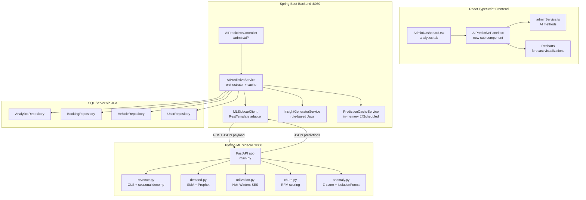
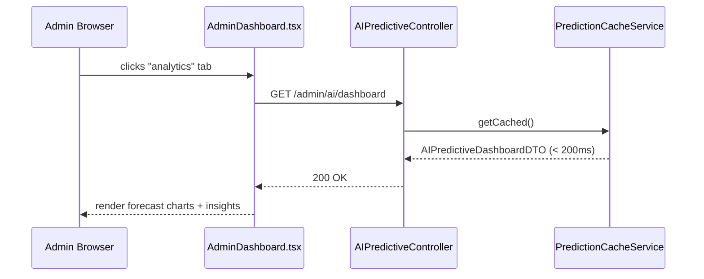
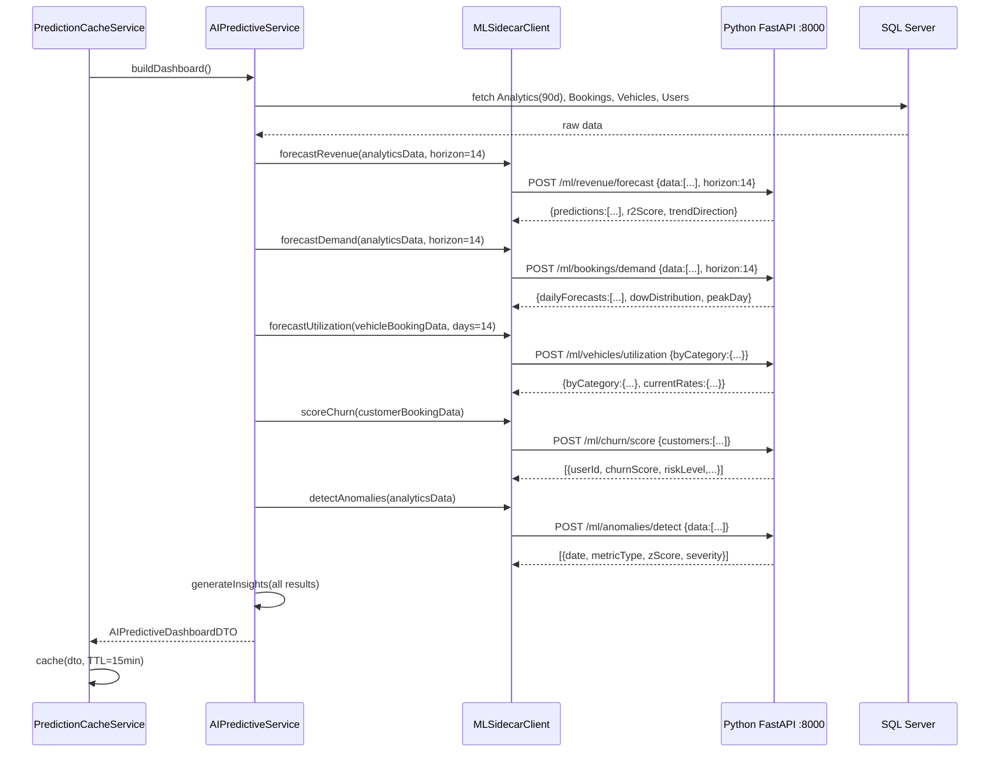
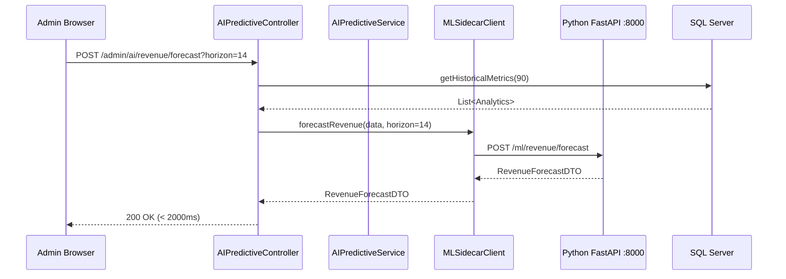
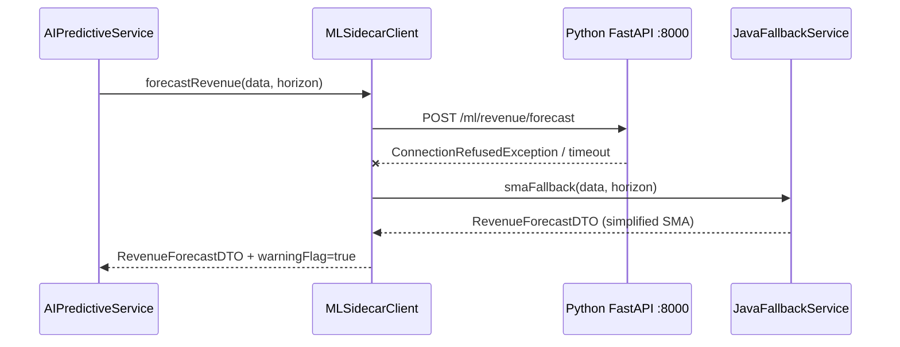

# Design Document: AI Predictive Analytics for Admin Panel

## Overview

LuxeWay's admin panel currently provides historical analytics (30-day revenue charts, booking counts, vehicle stats) via the `analytics` tab in `AdminDashboard.tsx`. This feature extends that tab with AI-powered predictive capabilities: revenue forecasting, booking demand prediction, vehicle utilization forecasting, customer churn risk detection, anomaly detection, and a natural-language AI Insights Panel.

The implementation uses a **Python FastAPI sidecar service** (`src/ml_service/`) running alongside the Spring Boot backend. Spring Boot remains the API gateway and data owner — it handles auth, DB access via JPA, and caching. The Python sidecar is a pure computation service that receives data arrays as JSON and returns predictions. The frontend is unchanged.

The entire feature is surfaced within the **existing `analytics` tab** of `AdminDashboard.tsx` as collapsible sections below the current charts. No new pages or routes are created. All prediction endpoints must respond in under 2 seconds using pre-computed / cached results that are refreshed on a scheduled cron cycle.

---

## Architecture



---

## Sequence Diagrams

### Admin Loads AI Analytics Tab (cache hit)



### Cache Miss — Spring Boot → Python Sidecar



### On-Demand Forecast Refresh



### Python Sidecar Unreachable — Fallback



---

## Components and Interfaces

### Backend: AIPredictiveController (Spring Boot)

**Purpose**: REST entry point for all AI prediction endpoints, secured with `ROLE_ADMIN` and `ROLE_SUPER_ADMIN`.

**Interface**:
```java
@RestController
@RequestMapping("/admin/ai")
@PreAuthorize("hasAnyRole('ADMIN', 'SUPER_ADMIN')")
public class AIPredictiveController {

    GET  /dashboard                        → ApiResponse<AIPredictiveDashboardDTO>
    POST /revenue/forecast?horizon={days}  → ApiResponse<RevenueForecastDTO>
    POST /bookings/demand?horizon={days}   → ApiResponse<BookingDemandDTO>
    POST /vehicles/utilization?days={days} → ApiResponse<VehicleUtilizationDTO>
    GET  /users/churn                      → ApiResponse<List<ChurnRiskDTO>>
    GET  /anomalies                        → ApiResponse<List<AnomalyDTO>>
    GET  /insights                         → ApiResponse<List<InsightDTO>>
}
```

---

### Backend: MLSidecarClient (Spring Boot)

**Purpose**: Wraps all HTTP calls from Spring Boot to the Python FastAPI sidecar. Handles connection errors and activates Java fallback on failure.

**Interface**:
```java
@Component
public class MLSidecarClient {

    // Base URL from application.yml: ml.service.url=http://localhost:8000
    private final RestTemplate restTemplate;
    private final String mlServiceUrl;

    RevenueForecastDTO forecastRevenue(List<AnalyticsDataPoint> data, int horizon);
    BookingDemandDTO forecastDemand(List<AnalyticsDataPoint> data, int horizon);
    VehicleUtilizationDTO forecastUtilization(Map<String, List<Double>> byCategoryData, int days);
    List<ChurnRiskDTO> scoreChurn(List<CustomerDataPoint> customers);
    List<AnomalyDTO> detectAnomalies(List<AnalyticsDataPoint> data);
    boolean isHealthy();  // GET /ml/health
}
```

**Fallback behavior**: If `RestClientException` or timeout (5s) is thrown, `MLSidecarClient` calls `JavaFallbackService` which implements simple 7-day SMA for all forecast types and returns results with `warningFlag = true`.

---

### Backend: AIPredictiveService (Spring Boot Orchestrator)

**Purpose**: Fetches data from DB, sends to Python sidecar via `MLSidecarClient`, assembles `AIPredictiveDashboardDTO`, and manages the 15-minute cache.

**Interface**:
```java
@Service
public class AIPredictiveService {
    AIPredictiveDashboardDTO buildDashboard();
    @PostConstruct void warmCache();
    @Scheduled(fixedRate = 900000) void refreshCache();
}
```

---

### Backend: InsightGeneratorService (Spring Boot)

**Purpose**: Rule-based insight generation in Java, operating on the assembled `AIPredictiveDashboardDTO`. No Python call needed — pure logic.

**Interface**:
```java
@Service
public class InsightGeneratorService {
    List<InsightDTO> generateInsights(AIPredictiveDashboardDTO dashboard);
}
```

---

### Backend: PredictionCacheService (Spring Boot)

**Purpose**: Holds the latest `AIPredictiveDashboardDTO` in a `volatile` field. Refreshed every 15 minutes by `@Scheduled`.

**Interface**:
```java
@Service
public class PredictionCacheService {
    AIPredictiveDashboardDTO getCached();
    void store(AIPredictiveDashboardDTO dto);
    LocalDateTime getLastRefreshed();
}
```

---

### Python ML Sidecar

**Purpose**: Pure computation service. Receives data arrays from Spring Boot as JSON, runs ML algorithms, returns predictions as JSON. Has **no database access**.

**Framework**: FastAPI 0.111 + Uvicorn, Python 3.11+

**Startup**: `uvicorn main:app --host 0.0.0.0 --port 8000`

**Directory structure**:
```
src/ml_service/
├── main.py                  # FastAPI app, router registration
├── requirements.txt
├── routers/
│   ├── revenue.py           # POST /ml/revenue/forecast
│   ├── demand.py            # POST /ml/bookings/demand
│   ├── utilization.py       # POST /ml/vehicles/utilization
│   ├── churn.py             # POST /ml/churn/score
│   ├── anomaly.py           # POST /ml/anomalies/detect
│   └── health.py            # GET  /ml/health
├── models/
│   ├── schemas.py           # Pydantic request/response models
│   └── algorithms.py        # Stateless algorithm implementations
└── tests/
    ├── test_revenue.py
    ├── test_demand.py
    ├── test_churn.py
    └── test_anomaly.py
```

**Endpoint interfaces** (Pydantic schemas):

```python
# POST /ml/revenue/forecast
class RevenueForecastRequest(BaseModel):
    data: list[dict]   # [{date: str, revenue: float, bookingsCount: int}, ...]
    horizon: int       # 1-30

class ForecastPoint(BaseModel):
    date: str
    predicted_revenue: float
    lower_bound: float
    upper_bound: float

class RevenueForecastResponse(BaseModel):
    predictions: list[ForecastPoint]
    r2_score: float
    trend_slope: float
    trend_direction: str   # "UP" | "DOWN" | "STABLE"
    warning_flag: bool     # True if fallback was used

# POST /ml/bookings/demand
class DemandForecastRequest(BaseModel):
    data: list[dict]   # [{date: str, bookingsCount: int}, ...]
    horizon: int

class DemandForecastResponse(BaseModel):
    daily_forecasts: list[ForecastPoint]
    dow_distribution: dict[str, float]  # {"MONDAY": 0.18, ...}
    peak_day: str
    avg_daily_demand: float

# POST /ml/vehicles/utilization
class UtilizationRequest(BaseModel):
    by_category: dict[str, list[dict]]  # {category: [{date, rate}, ...]}
    forecast_days: int

class UtilizationResponse(BaseModel):
    by_category: dict[str, list[ForecastPoint]]
    current_rates: dict[str, float]
    lowest_category: str
    highest_category: str

# POST /ml/churn/score
class CustomerRecord(BaseModel):
    user_id: str
    display_name: str
    email: str
    bookings: list[dict]   # [{end_date: str, total: float}, ...]

class ChurnRequest(BaseModel):
    customers: list[CustomerRecord]
    platform_avg_frequency: float
    platform_avg_spend: float

class ChurnResponse(BaseModel):
    results: list[dict]   # ChurnRiskDTO fields

# POST /ml/anomalies/detect
class AnomalyRequest(BaseModel):
    data: list[dict]   # [{date, revenue, bookingsCount}, ...]

class AnomalyResponse(BaseModel):
    anomalies: list[dict]   # AnomalyDTO fields
```

---

### Frontend: AIPredictivePanel (new sub-component)

**Purpose**: New React component rendered inside the `analytics` tab of `AdminDashboard.tsx`. Appended below existing charts. **No frontend changes are needed for the Python sidecar** — same DTO shapes, same API endpoints.

**Interface**:
```typescript
interface AIPredictivePanelProps {
  isDark: boolean;
  currency: string;
}

const AIPredictivePanel: React.FC<AIPredictivePanelProps> = ({ isDark, currency }) => { ... }
```

**Renders 6 sections** using existing Recharts components:
1. Revenue Forecast — `AreaChart` with confidence band (upper/lower)
2. Booking Demand — `BarChart` + day-of-week distribution
3. Vehicle Utilization — `LineChart` per category
4. Churn Risk — ranked list with risk-level badges
5. Anomaly Detection — scatter points overlaid on revenue chart
6. AI Insights Panel — severity-sorted insight cards

---

### Frontend: adminService.ts additions

```typescript
async getAIPredictiveDashboard(): Promise<AIPredictiveDashboardDTO | null>
// GET /admin/ai/dashboard

async refreshRevenueForecast(horizon: number): Promise<RevenueForecastDTO | null>
// POST /admin/ai/revenue/forecast?horizon={horizon}

async refreshBookingDemand(horizon: number): Promise<BookingDemandDTO | null>
// POST /admin/ai/bookings/demand?horizon={horizon}

async getChurnRisks(): Promise<ChurnRiskDTO[]>
// GET /admin/ai/users/churn

async getAnomalies(): Promise<AnomalyDTO[]>
// GET /admin/ai/anomalies

async getAIInsights(): Promise<InsightDTO[]>
// GET /admin/ai/insights
```

---

## Data Models

### Java DTOs (Spring Boot — unchanged from original design)

```java
public record AIPredictiveDashboardDTO(
    RevenueForecastDTO    revenueForecast,
    BookingDemandDTO      bookingDemand,
    VehicleUtilizationDTO vehicleUtilization,
    List<ChurnRiskDTO>    churnRisks,
    List<AnomalyDTO>      anomalies,
    List<InsightDTO>      insights,
    LocalDateTime         generatedAt,
    boolean               sidecarWarning   // true if fallback was used
) {}

public record RevenueForecastDTO(
    List<ForecastPoint> predictions,
    double              r2Score,
    double              trendSlope,
    String              trendDirection
) {}

public record ForecastPoint(
    LocalDate date,
    double    predictedRevenue,
    double    lowerBound,
    double    upperBound
) {}

public record BookingDemandDTO(
    List<ForecastPoint>    dailyForecasts,
    Map<DayOfWeek, Double> dowDistribution,
    String                 peakDay,
    double                 avgDailyDemand
) {}

public record VehicleUtilizationDTO(
    Map<String, List<ForecastPoint>> byCategory,
    Map<String, Double>              currentRates,
    String                           lowestCategory,
    String                           highestCategory
) {}

public record ChurnRiskDTO(
    String     userId,
    String     displayName,
    String     email,
    double     churnScore,
    String     riskLevel,
    int        daysSinceLastBooking,
    int        totalBookings,
    BigDecimal totalSpend
) {}

public record AnomalyDTO(
    LocalDate date,
    String    metricType,
    double    actualValue,
    double    expectedValue,
    double    zScore,
    String    severity
) {}

public record InsightDTO(
    String        insightId,
    String        type,
    String        severity,
    String        title,
    String        description,
    String        actionLabel,
    LocalDateTime generatedAt
) {}
```

### TypeScript types (Frontend — unchanged)

```typescript
export interface ForecastPoint {
  date: string;
  predictedRevenue?: number;
  predictedBookings?: number;
  lowerBound: number;
  upperBound: number;
}

export interface RevenueForecastDTO {
  predictions: ForecastPoint[];
  r2Score: number;
  trendSlope: number;
  trendDirection: 'UP' | 'DOWN' | 'STABLE';
}

export interface BookingDemandDTO {
  dailyForecasts: ForecastPoint[];
  dowDistribution: Record<string, number>;
  peakDay: string;
  avgDailyDemand: number;
}

export interface VehicleUtilizationDTO {
  byCategory: Record<string, ForecastPoint[]>;
  currentRates: Record<string, number>;
  lowestCategory: string;
  highestCategory: string;
}

export interface ChurnRiskDTO {
  userId: string;
  displayName: string;
  email: string;
  churnScore: number;
  riskLevel: 'LOW' | 'MEDIUM' | 'HIGH' | 'CRITICAL';
  daysSinceLastBooking: number;
  totalBookings: number;
  totalSpend: number;
}

export interface AnomalyDTO {
  date: string;
  metricType: 'REVENUE' | 'BOOKINGS';
  actualValue: number;
  expectedValue: number;
  zScore: number;
  severity: 'WARNING' | 'CRITICAL';
}

export interface InsightDTO {
  insightId: string;
  type: string;
  severity: 'INFO' | 'WARNING' | 'CRITICAL';
  title: string;
  description: string;
  actionLabel: string;
  generatedAt: string;
}

export interface AIPredictiveDashboardDTO {
  revenueForecast: RevenueForecastDTO;
  bookingDemand: BookingDemandDTO;
  vehicleUtilization: VehicleUtilizationDTO;
  churnRisks: ChurnRiskDTO[];
  anomalies: AnomalyDTO[];
  insights: InsightDTO[];
  generatedAt: string;
  sidecarWarning?: boolean;
}
```

---

## Python Algorithm Implementations

### Revenue Forecast: OLS with Seasonal Decomposition (`statsmodels`)

```python
# routers/revenue.py
import pandas as pd
import numpy as np
from statsmodels.regression.linear_model import OLS
from statsmodels.tools import add_constant

def forecast_revenue(data: list[dict], horizon: int) -> dict:
    """
    PRECONDITIONS:
      - len(data) >= 14
      - horizon in [1, 30]
    POSTCONDITIONS:
      - len(result['predictions']) == horizon
      - all p['predicted_revenue'] >= 0.0
      - all p['lower_bound'] <= p['predicted_revenue'] <= p['upper_bound']
      - result['r2_score'] in [0.0, 1.0]
    """
    df = pd.DataFrame(data)
    df['date'] = pd.to_datetime(df['date'])
    df = df.sort_values('date').reset_index(drop=True)
    n = len(df)

    # Feature matrix: day_index + one-hot DoW (Mon-Sat, Sun is baseline)
    X = np.zeros((n, 8))
    X[:, 0] = np.arange(n)                                 # trend
    for i, row in df.iterrows():
        dow = row['date'].weekday()                         # 0=Mon, 6=Sun
        if dow < 6:
            X[i, dow + 1] = 1.0
    X[:, 7] = 1.0                                          # intercept

    y = df['revenue'].values.astype(float)

    try:
        model = OLS(y, X).fit()
        params = model.params
        r2 = max(0.0, min(1.0, model.rsquared))
        residual_std = np.std(model.resid)
        ci_95 = 1.96 * residual_std
        warning_flag = False
    except Exception:
        # Fallback to 7-day SMA
        return _sma_revenue_fallback(df, horizon)

    last_date = df['date'].iloc[-1]
    predictions = []
    for h in range(horizon):
        future_date = last_date + pd.Timedelta(days=h + 1)
        x_row = np.zeros(8)
        x_row[0] = n + h
        dow = future_date.weekday()
        if dow < 6:
            x_row[dow + 1] = 1.0
        x_row[7] = 1.0
        predicted = max(0.0, float(params @ x_row))
        predictions.append({
            "date": future_date.strftime("%Y-%m-%d"),
            "predicted_revenue": predicted,
            "lower_bound": max(0.0, predicted - ci_95),
            "upper_bound": predicted + ci_95,
        })

    slope = float(params[0])
    trend = "UP" if slope > 50000 else ("DOWN" if slope < -50000 else "STABLE")

    # LOOP INVARIANT: after iteration h, predictions[0..h-1] contain non-negative values
    return {
        "predictions": predictions,
        "r2_score": r2,
        "trend_slope": slope,
        "trend_direction": trend,
        "warning_flag": False,
    }
```

### Booking Demand: SMA + Day-of-Week Adjustment

```python
def forecast_demand(data: list[dict], horizon: int) -> dict:
    """
    PRECONDITIONS: len(data) >= 7, horizon in [1, 30]
    POSTCONDITIONS:
      - len(result['daily_forecasts']) == horizon
      - all f['predicted_bookings'] >= 0.0
      - result['peak_day'] in {MON,TUE,WED,THU,FRI,SAT,SUN}
    """
    df = pd.DataFrame(data)
    df['date'] = pd.to_datetime(df['date'])
    df = df.sort_values('date').reset_index(drop=True)

    DAYS = ['MONDAY','TUESDAY','WEDNESDAY','THURSDAY','FRIDAY','SATURDAY','SUNDAY']
    WINDOW = 7

    # DoW distribution
    dow_sums = {d: 0.0 for d in DAYS}
    dow_counts = {d: 0 for d in DAYS}
    for _, row in df.iterrows():
        d = DAYS[row['date'].weekday()]
        dow_sums[d] += row['bookingsCount']
        dow_counts[d] += 1
    dow_avg = {d: (dow_sums[d] / dow_counts[d] if dow_counts[d] > 0 else 0.0) for d in DAYS}
    total_avg = sum(dow_avg.values()) / 7
    peak_day = max(dow_avg, key=dow_avg.get)

    series = list(df['bookingsCount'].values.astype(float))
    last_date = df['date'].iloc[-1]
    forecasts = []

    for h in range(horizon):
        window = series[-WINDOW:]
        sma = float(np.mean(window))
        std = float(np.std(window))
        future_date = last_date + pd.Timedelta(days=h + 1)
        d = DAYS[future_date.weekday()]
        factor = (dow_avg[d] / total_avg) if total_avg > 0 else 1.0
        adjusted = max(0.0, sma * factor)
        ci = 1.96 * std
        forecasts.append({
            "date": future_date.strftime("%Y-%m-%d"),
            "predicted_bookings": adjusted,
            "lower_bound": max(0.0, adjusted - ci),
            "upper_bound": adjusted + ci,
        })
        series.append(adjusted)
        # LOOP INVARIANT: len(series) == n + h + 1; all values >= 0

    return {
        "daily_forecasts": forecasts,
        "dow_distribution": {d: dow_avg[d] / sum(dow_avg.values()) if sum(dow_avg.values()) > 0 else 0 for d in DAYS},
        "peak_day": peak_day,
        "avg_daily_demand": float(np.mean(df['bookingsCount'])),
    }
```

### Vehicle Utilization: Holt-Winters SES (`statsmodels`)

```python
from statsmodels.tsa.holtwinters import SimpleExpSmoothing

def forecast_utilization(by_category: dict, forecast_days: int) -> dict:
    """
    PRECONDITIONS: forecast_days in [1, 30]; each category list has >= 7 points
    POSTCONDITIONS:
      - all predicted values in [0.0, 1.0]
      - len(byCategory[cat]) == forecast_days for each cat
    """
    result_by_cat = {}
    current_rates = {}

    for cat, series_data in by_category.items():
        rates = [max(0.0, min(1.0, float(r))) for r in series_data]
        current_rates[cat] = rates[-1] if rates else 0.0

        if len(rates) < 2:
            forecast_val = rates[0] if rates else 0.0
            forecasts = [{"date": "", "predicted": forecast_val,
                          "lower_bound": max(0.0, forecast_val - 0.05),
                          "upper_bound": min(1.0, forecast_val + 0.05)}] * forecast_days
        else:
            model = SimpleExpSmoothing(rates, initialization_method="estimated").fit(
                smoothing_level=0.3, optimized=False
            )
            raw = model.forecast(forecast_days)
            forecasts = []
            for val in raw:
                val = max(0.0, min(1.0, float(val)))
                forecasts.append({
                    "predicted": val,
                    "lower_bound": max(0.0, val - 0.05),
                    "upper_bound": min(1.0, val + 0.05),
                })
        result_by_cat[cat] = forecasts
        # LOOP INVARIANT: all forecast values in [0.0, 1.0]

    lowest = min(current_rates, key=current_rates.get) if current_rates else None
    highest = max(current_rates, key=current_rates.get) if current_rates else None
    return {
        "by_category": result_by_cat,
        "current_rates": current_rates,
        "lowest_category": lowest,
        "highest_category": highest,
    }
```

### Churn Risk: RFM Scoring

```python
def score_churn(customers: list[dict], platform_avg_freq: float, platform_avg_spend: float) -> list[dict]:
    """
    PRECONDITIONS: platform_avg_freq >= 0, platform_avg_spend >= 0
    POSTCONDITIONS:
      - all churn_score in [0.0, 100.0]
      - risk_level in {LOW, MEDIUM, HIGH, CRITICAL}
      - result sorted descending by churn_score
      - len(result) <= 50
    """
    from datetime import date

    results = []
    today = date.today()

    for c in customers:
        bookings = [b for b in c['bookings'] if b.get('status') == 'COMPLETED']

        # RECENCY
        if not bookings:
            recency_days = 999
        else:
            last_date = max(pd.to_datetime(b['end_date']).date() for b in bookings)
            recency_days = (today - last_date).days
        recency_score = min(100.0, recency_days / 90.0 * 100.0)

        # FREQUENCY
        freq = len(bookings)
        if platform_avg_freq > 0:
            freq_score = max(0.0, min(100.0, (1.0 - freq / (platform_avg_freq * 2.0)) * 100.0))
        else:
            freq_score = 100.0

        # MONETARY
        spend = sum(float(b.get('total', 0)) for b in bookings)
        if platform_avg_spend > 0:
            monetary_score = max(0.0, min(100.0, (1.0 - spend / (platform_avg_spend * 2.0)) * 100.0))
        else:
            monetary_score = 100.0

        # Weighted composite
        churn_score = 0.40 * recency_score + 0.35 * freq_score + 0.25 * monetary_score
        # LOOP INVARIANT: churn_score in [0.0, 100.0]

        if churn_score >= 80:   risk_level = "CRITICAL"
        elif churn_score >= 60: risk_level = "HIGH"
        elif churn_score >= 40: risk_level = "MEDIUM"
        else:                   risk_level = "LOW"

        results.append({
            "user_id": c['user_id'],
            "display_name": c['display_name'],
            "email": c['email'],
            "churn_score": churn_score,
            "risk_level": risk_level,
            "days_since_last_booking": recency_days,
            "total_bookings": freq,
            "total_spend": spend,
        })

    results.sort(key=lambda x: x['churn_score'], reverse=True)
    return results[:50]
```

### Anomaly Detection: Z-Score + IsolationForest

```python
from sklearn.ensemble import IsolationForest

def detect_anomalies(data: list[dict]) -> list[dict]:
    """
    PRECONDITIONS: len(data) >= 14
    POSTCONDITIONS:
      - all |zScore| > 2.0
      - severity in {WARNING, CRITICAL}
      - result sorted descending by date
    """
    df = pd.DataFrame(data).sort_values('date').reset_index(drop=True)
    WINDOW = 14
    Z_THRESHOLD = 2.0
    CRITICAL_Z = 3.0
    anomalies = []

    for metric in ['revenue', 'bookingsCount']:
        series = df[metric].values.astype(float)
        n = len(series)

        for i in range(WINDOW, n):
            window_slice = series[i - WINDOW:i]
            mean = float(np.mean(window_slice))
            std = float(np.std(window_slice))

            if std == 0.0:
                continue   # avoid division by zero

            z = (series[i] - mean) / std

            if abs(z) > Z_THRESHOLD:
                severity = "CRITICAL" if abs(z) > CRITICAL_Z else "WARNING"
                anomalies.append({
                    "date": str(df['date'].iloc[i]),
                    "metric_type": "REVENUE" if metric == 'revenue' else "BOOKINGS",
                    "actual_value": float(series[i]),
                    "expected_value": mean,
                    "z_score": z,
                    "severity": severity,
                })
            # LOOP INVARIANT: window_slice has exactly WINDOW elements from [i-WINDOW, i-1]

    anomalies.sort(key=lambda x: x['date'], reverse=True)
    return anomalies
```

---

## Key Function Specifications

### `forecast_revenue(data, horizon)` — Python

**Preconditions**: `len(data) >= 14`, `1 <= horizon <= 30`

**Postconditions**:
- `len(result.predictions) == horizon`
- `r2_score ∈ [0.0, 1.0]`
- `all(p.predicted_revenue >= 0.0 for p in result.predictions)`
- `all(p.lower_bound <= p.predicted_revenue <= p.upper_bound for p in result.predictions)`

**Loop Invariant** (prediction loop): After iteration h, `predictions[0..h-1]` all have `predicted_revenue >= 0.0`

---

### `score_churn(customers, avg_freq, avg_spend)` — Python

**Preconditions**: `avg_freq >= 0`, `avg_spend >= 0`

**Postconditions**:
- `all(0.0 <= c.churn_score <= 100.0 for c in result)`
- `result == sorted(result, key=lambda c: c.churn_score, reverse=True)`
- `len(result) <= 50`

**Loop Invariant**: After each customer processed, `churn_score ∈ [0.0, 100.0]`

---

### `detect_anomalies(data)` — Python

**Preconditions**: `len(data) >= 14`

**Postconditions**:
- `all(abs(a.z_score) > 2.0 for a in result)`
- `all(a.severity == "CRITICAL" iff abs(a.z_score) > 3.0 for a in result)`

**Loop Invariant**: At step i, `window_slice` contains exactly the 14 elements at indices `[i-14, i-1]`

---

### `MLSidecarClient.forecastRevenue(data, horizon)` — Java

**Preconditions**: `horizon ∈ [1, 30]`, `data.size() >= 14`

**Postconditions**:
- Returns non-null `RevenueForecastDTO`
- If sidecar unreachable: returns SMA fallback result with `warningFlag = true`
- Response time < 2000ms (timeout = 5000ms, fallback activates at 5001ms)

---

## Correctness Properties

### Property 1: Revenue Forecast Non-Negativity
For any `data` with ≥ 14 records and any `horizon ∈ [1, 30]`, every `ForecastPoint.predictedRevenue ≥ 0.0`. Enforced by `max(0.0, predicted)` in Python. **Validates: Requirements 1.3**

### Property 2: Confidence Interval Ordering
For all `ForecastPoint p`: `p.lowerBound ≤ p.predictedRevenue ≤ p.upperBound`. **Validates: Requirements 1.2**

### Property 3: Forecast Horizon Coverage
`forecast_revenue(data, horizon).predictions` has exactly `horizon` entries. **Validates: Requirements 1.1**

### Property 4: Churn Score Bounds
All `ChurnRiskDTO.churnScore ∈ [0.0, 100.0]`. Enforced by `min(100.0, ...)` and `max(0.0, ...)` clamps. **Validates: Requirements 4.1, 4.5**

### Property 5: Churn Level Consistency
`CRITICAL ↔ score ≥ 80`, `HIGH ↔ [60,80)`, `MEDIUM ↔ [40,60)`, `LOW ↔ < 40`. **Validates: Requirements 4.2**

### Property 6: Anomaly Z-Score Threshold
All returned anomalies have `|zScore| > 2.0`. Positions where `std == 0` are skipped. **Validates: Requirements 5.1, 5.3**

### Property 7: Anomaly Severity Consistency
`CRITICAL ↔ |z| > 3.0`, `WARNING ↔ 2.0 < |z| ≤ 3.0`. **Validates: Requirements 5.2**

### Property 8: Utilization Rate Bounds
All utilization forecast values ∈ `[0.0, 1.0]`. Input clamped before SES. **Validates: Requirements 3.1, 3.4**

### Property 9: SES Smoothing Invariant
With α = 0.3 and inputs ∈ `[0.0, 1.0]`, the SES smoothed value remains in `[0.0, 1.0]` by convex combination. **Validates: Requirements 3.2**

### Property 10: Cache Response Time
`PredictionCacheService.getCached()` returns in < 200ms (in-memory read). **Validates: Requirements 7.1**

### Property 11: Insight Count Limit
`InsightGeneratorService` returns at most 8 `InsightDTO` entries. **Validates: Requirements 6.1**

### Property 12: Fallback Activation
When Python sidecar is unreachable, `MLSidecarClient` activates Java SMA fallback and sets `sidecarWarning = true`. Non-null result always returned. **Validates: Requirements 10.4**

### Property 13: Security — Admin Only
All `/admin/ai/**` endpoints return HTTP 401 for missing/invalid JWT and HTTP 403 for authenticated non-admin roles. **Validates: Requirements 8.1, 8.2**

### Property 14: SMA Non-Negativity (Fallback)
Java SMA fallback enforces `max(0, value)` on all output values. **Validates: Requirements 2.2**

### Property 15: Churn Result Sort Order
`result[i].churnScore >= result[i+1].churnScore` for all adjacent pairs. **Validates: Requirements 4.3**

---

## Error Handling

### Scenario 1: Python Sidecar Unreachable
**Condition**: `RestClientException` or connection timeout (5s) when calling `http://ml-service:8000`.

**Response**: `MLSidecarClient` catches exception, calls `JavaFallbackService` (7-day SMA for all forecast types), sets `sidecarWarning = true` in `AIPredictiveDashboardDTO`. Spring Boot logs `WARN` with sidecar URL and exception type.

**Recovery**: Next scheduled cache refresh (15 min) re-attempts sidecar. Admin sees "Using simplified forecast model" banner in `AIPredictivePanel`.

---

### Scenario 2: Insufficient Historical Data (< 14 records)
**Condition**: `analytics` table has fewer than 14 records.

**Response**: `AIPredictiveService` returns `AIPredictiveDashboardDTO` with empty prediction lists and a single `INFO` insight: *"Forecasts available after 14 days of platform operation."*

**Recovery**: `@Scheduled` daily aggregation populates data automatically.

---

### Scenario 3: Python Sidecar Returns 4xx/5xx
**Condition**: Sidecar reachable but returns error (e.g., 422 Unprocessable Entity for malformed payload).

**Response**: `MLSidecarClient` logs the HTTP status and response body, activates Java fallback with `sidecarWarning = true`.

**Recovery**: Spring Boot's serialization layer is the root cause — log and fix the payload schema mismatch.

---

### Scenario 4: Frontend API Failure
**Condition**: `/admin/ai/dashboard` returns 5xx.

**Response**: `AIPredictivePanel` shows dismissible error banner: *"AI Predictions temporarily unavailable."* Existing historical analytics charts remain visible.

**Recovery**: Manual "Refresh" button re-triggers the API call.

---

### Scenario 5: Cache Cold Start Race Condition
**Condition**: Cache not populated and concurrent requests arrive at startup.

**Response**: `PredictionCacheService` uses a `synchronized` block on cache population. Subsequent requests wait (< 5s) and then read from populated cache.

---

## Performance Considerations

| Scenario | Target | Strategy |
|---|---|---|
| `/admin/ai/dashboard` (cache hit) | < 200ms | `PredictionCacheService` in-memory `volatile` field |
| `/admin/ai/dashboard` (cache miss) | < 5000ms | Parallel sidecar calls via Spring `CompletableFuture` |
| On-demand forecast endpoint | < 2000ms | Direct sidecar call; no full rebuild |
| Python sidecar — revenue forecast | < 800ms | `statsmodels` OLS on 90×8 matrix; trivial |
| Python sidecar — churn (500 customers) | < 1000ms | Vectorized pandas; no per-customer I/O |
| Java fallback (SMA) | < 200ms | Pure in-memory loop; no I/O |
| Cache warm-up at startup | < 5s | `@PostConstruct` async task |

**Parallel sidecar calls**: `AIPredictiveService.buildDashboard()` fires 5 `CompletableFuture` calls to `MLSidecarClient` concurrently, reducing total latency from ~4s sequential to ~1s parallel.

---

## Security Considerations

- All `/admin/ai/**` endpoints require `ROLE_ADMIN` or `ROLE_SUPER_ADMIN` via `@PreAuthorize`
- Python sidecar binds to `localhost:8000` (or internal Docker network) — never exposed directly to the public internet
- Spring Boot is the only caller of the Python sidecar; admin JWT is not forwarded to the sidecar
- `ChurnRiskDTO` fields (email, name, spend) only returned via secured admin endpoints
- Rate limiting on POST endpoints: 10 requests/minute per authenticated admin identity (JWT subject)
- Sidecar request payload contains only anonymized data arrays — no PII transmitted to Python service

---

## Dependencies

### New Python sidecar (`src/ml_service/requirements.txt`)

```
fastapi==0.111.0
uvicorn==0.29.0
scikit-learn==1.4.2
statsmodels==0.14.2
pandas==2.2.2
numpy==1.26.4
prophet==1.1.5
pydantic==2.7.1
pytest==8.2.0
httpx==0.27.0
```

### Spring Boot `pom.xml` — no new dependencies required
All needed libraries (`spring-boot-starter-web`, `spring-boot-starter-data-jpa`, `lombok`, `spring-boot-starter-security`) are already present. `commons-math3` is **not** needed.

### New Spring Boot `application.yml` property
```yaml
ml:
  service:
    url: http://localhost:8000
    timeout-ms: 5000
```

### Existing frontend dependencies used (no new npm packages)
`recharts`, `framer-motion`, `lucide-react`, `@/services/adminService`, `@/utils`

---

## Testing Strategy

### Python Unit Tests (`pytest`)
- `test_revenue.py`: non-negativity, horizon coverage, CI ordering, R² bounds, OLS failure → SMA fallback
- `test_demand.py`: SMA correctness vs manual calculation, DoW distribution sums to 1.0 ± 0.001
- `test_churn.py`: RFM weights, threshold boundaries, sort order, max 50 results
- `test_anomaly.py`: Z-score threshold filter (`|z| > 2.0`), `std=0` skip, severity assignment

### Python Property-Based Tests (`hypothesis`)
```python
from hypothesis import given, strategies as st

@given(
    data=st.lists(revenue_record_strategy, min_size=14, max_size=90),
    horizon=st.integers(min_value=1, max_value=30)
)
def test_revenue_horizon_coverage(data, horizon):
    result = forecast_revenue(data, horizon)
    assert len(result['predictions']) == horizon

@given(customers=st.lists(customer_strategy, min_size=1, max_size=200))
def test_churn_score_bounds(customers):
    results = score_churn(customers, 3.0, 15000000.0)
    assert all(0.0 <= c['churn_score'] <= 100.0 for c in results)
```

### Spring Boot Integration Tests (`@SpringBootTest`)
- `AIPredictiveControllerTest`: all 7 endpoints return 200 OK with mock `MLSidecarClient`
- Security: 401 for missing JWT, 403 for non-admin role
- Fallback: mock sidecar throws `ResourceAccessException` → verify `sidecarWarning = true` in response

### End-to-End Latency Test
- Cache hit: `/admin/ai/dashboard` responds < 200ms
- On-demand: `POST /admin/ai/revenue/forecast` responds < 2000ms with real Python sidecar running
